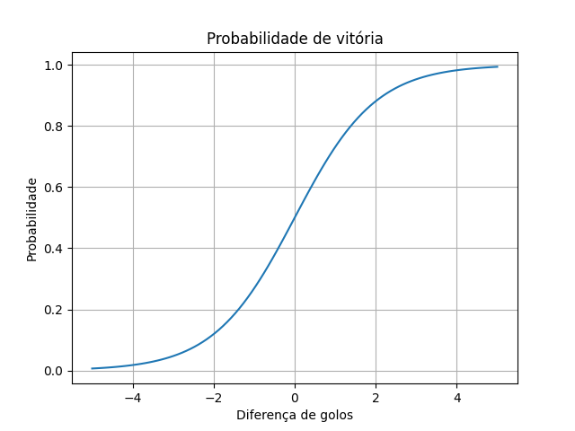
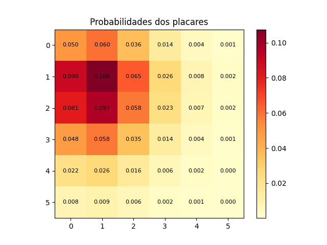

# Betting Odds Probability Analysis

This project explores the relationship between betting odds and probabilities using basic concepts from statistics and data science.

The goal is to understand how odds can be interpreted, how to evaluate bets, and how simple models can be used to estimate match outcomes.

---

## Concepts

The following concepts were applied in this project:

- Conversion of decimal odds into implied probabilities  
- Expected Value (EV) calculation to evaluate bets  
- Logistic function to model win probability  
- Poisson distribution to estimate the number of goals  
- Monte Carlo simulation to approximate match results  

---

## Implementation

The project was developed in Python using:

- NumPy  
- Pandas  
- Matplotlib  

The code includes:

- Conversion of betting odds into probabilities  
- Calculation of expected value  
- A simple logistic model for win probability  
- A Poisson model to estimate score distributions  
- Simulation of matches using random sampling  

---

## Results

### Logistic Regression



This graph shows how the probability of winning changes depending on the difference in goals between two teams.

---

### Poisson Model



This matrix represents the probability of each possible score using the Poisson distribution.

---

## Observations

- Betting odds can be interpreted as probabilities  
- Expected Value helps identify whether a bet is favorable  
- The Poisson distribution is useful for modelling football scores  
- Simulation results are consistent with the calculated probabilities  

---

## How to run

Install the required libraries:

```bash
pip install numpy pandas matplotlib

---

## Author

Fábio Gonçalves  
BSc in Data Science – ISCTE-IUL
